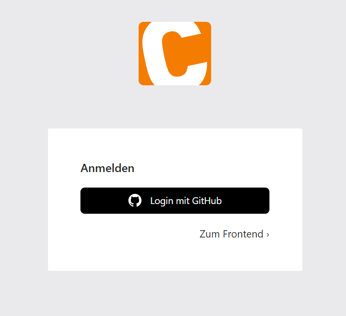

# Contao GitHub Login
This extension adds a GitHub login button to Contao, both in the frontend and in the backend. Before/after installation you have to register a GitHub App and save the `client_id` and `client_secret` in your .env file.
To activate or deactivate the application, the configuration file *config.yaml* must be edited under `config/config.yaml`.

**Frontend Module**

To display the login button in the frontend, create a member login module and select the *mod_login_github* template.

## Installation

`composer require markocupic/contao-github-login`

## Configuration

```yaml
# config/config.yaml
markocupic_contao_github_login:
    clients:
        backend:
            disable_contao_login: true
            enable_github_login: true
            enable_csrf_token_check: true
            redirect_route: 'markocupic_contao_github_backend_login'
            client_id: '%env(GITHUB_BACKEND_LOGIN_CLIENT_ID)%'
            client_secret: '%env(GITHUB_BACKEND_LOGIN_CLIENT_SECRET)%'
        frontend:
            enable_github_login: true
            enable_csrf_token_check: true
            redirect_route: 'markocupic_contao_github_frontend_login'
            client_id: '%env(GITHUB_FRONTEND_LOGIN_CLIENT_ID)%'
            client_secret: '%env(GITHUB_FRONTEND_LOGIN_CLIENT_SECRET)%'
```

```
# .env
GITHUB_BACKEND_LOGIN_CLIENT_ID=6337hdhks7d62277sd
GITHUB_BACKEND_LOGIN_CLIENT_SECRET=738gdsksd893723723932023023932
GITHUB_FRONTEND_LOGIN_CLIENT_ID=633zuiewr88d677sd
GITHUB_FRONTEND_LOGIN_CLIENT_SECRET=738g83489324972393rrwerwerwer
```

## Register GitHub App
1. Log in to your GitHub Account and go to [GitHub Developer Settings](https://github.com/settings/apps) to obtain your GitHub **client_id** and **client_secret**.
2. Register a new GitHub App. <span style="background-color:yellow">A new GitHub App must be set up for each login (frontend & backend).</span>
3. Add a name for your GitHub app.
4. Add the homepage URL: `https://your-contao-site.com`
5. Add the ***callback URL***: `https://your-contao-site.com/_github_backend_login` (Contao Backend Login) or `https://your-contao-site.com/_github_frontend_login` (Contao Frontend Login)
6. Save your settings.
7. Then you generate a new **client secret**
8. Both, the **client_id** and the **client_secret** you have to write to your .env file.
9. Click **Permissions & events** in the navigation on the left.
10. Open **Account permissions** and select **Read-only** access under **Email addresses**


| **Contao Backend**                                                                           | **GitHub App Settings**                                                            | **GitHub App Permissions**                                                               |
|----------------------------------------------------------------------------------------------|------------------------------------------------------------------------------------|------------------------------------------------------------------------------------------|
|  |  |  |


