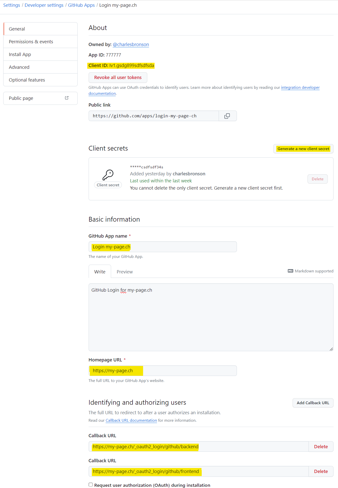

# Contao GitHub Login
This extension adds a GitHub login button to Contao, both in the frontend and in the backend. Before/after installation you have to register a GitHub App and save the `client_id` and `client_secret` in your .env file.
To activate or deactivate the application, the configuration file *config.yaml* must be edited under `config/config.yaml`.

**Frontend Module**

To display the login button in the frontend, create a member login module and select the *mod_login_github* template.

## Installation

`composer require markocupic/contao-github-login`

## Configuration

```yaml
# config/config.yaml
markocupic_contao_oauth2_client:
    disable_contao_core_backend_login: false  # Disable original Contao backend login
    enable_csrf_token_check: true

markocupic_contao_github_login:
    contao_oauth2_clients:
        github_backend:
            enable_login: true
            client_id: '%env(CONTAO_GITHUB_LOGIN_CLIENT_ID)%'
            client_secret: '%env(CONTAO_GITHUB_LOGIN_CLIENT_SECRET)%'

        github_frontend:
            enable_login: true
            client_id: '%env(CONTAO_GITHUB_LOGIN_CLIENT_ID)%'
            client_secret: '%env(CONTAO_GITHUB_LOGIN_CLIENT_SECRET)%'
```

```
# .env
CONTAO_GITHUB_LOGIN_CLIENT_ID=6337hdhks7d62277sd
CONTAO_GITHUB_LOGIN_CLIENT_SECRET=738gdsksd893723723932023023932
```

## Register GitHub App
1. Log in to your GitHub Account and go to [GitHub Developer Settings](https://github.com/settings/apps) to enter the **callback URLS** and get your GitHub **client_id** and **client_secret**.
2. Register a new GitHub App.
3. Add a name for your **GitHub app**.
4. Add the **homepage URL**: `https://my-page.ch`
5. Add the first **callback URL**: `https://my-page.ch/_oauth2_login/github/backend` for the Backend Login.
6. Add the second **callback URL**: `https://my-page.ch/_oauth2_login/github/frontend` for the Frontend Login.
7. Save your settings.
8. Generate the **client secret**
9. In a next step write the **client_id** and the **client_secret** to your .env file.
10. Click **Permissions & events** in the navigation on the left.
11. Open **Account permissions** and select **Read-only** access under **Email addresses**


| **Contao Backend**                                                                           | **GitHub App Settings**                                                            | **GitHub App Permissions**                                                               |
|----------------------------------------------------------------------------------------------|------------------------------------------------------------------------------------|------------------------------------------------------------------------------------------|
|  |  |  |


